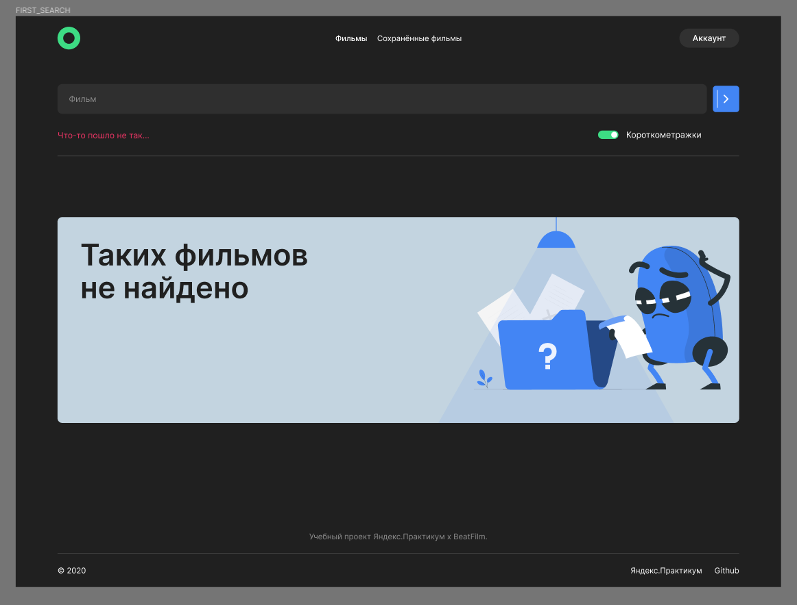

<h1 align="center">Дипломный проект: "Movies Explorer" (frontend)</h1>

  

<a name="summary">
  

    
Оглавление

    <ul>
      <li><a href="#description">Описание проекта</a></li>
      <li><a href="#tech">Стек технологий</a></li>
      <li><a href="#test">Установка и запуск приложения для тестирования</a></li>
      <li><a href="#function">Функционал</a></li>
      <li><a href="#tasks">Задачи</a></li>
      <li><a href="#version">Версии приложения</a></li>
    </ul>
  

</a>

<a name="description"><h2>1. Описание проекта</h2></a>
Проект "Movies Explorer" – это инновационное приложение, разработанное для удобного поиска и просмотра фильмов, представленных на международном фестивале документального кино <a href="https://beatfilmfestival.ru/">"Beat Film Festival"</a>. Создан в рамках образовательной программы от <a href="https://practicum.yandex.ru/">Яндекс Практикума</a>, этот дипломный проект представляет собой отзывчивое и адаптивное веб-приложение (SPA). Фронтенд, основанный на библиотеке "React", обеспечивает плавный и интерактивный пользовательский опыт, а бекенд, построенный на "Express", гарантирует надежность и эффективность обработки запросов.

<h3>Ссылки на проект:</h3>
<b>IP:</b> 84.201.131.226
 
<b>Frontend:</b> https://movie.dekolpakov.nomoredomainsmonster.ru
 
<b>Backend:</b> https://api.movie.dekolpakov.nomoredomainsmonster.ru
 
<b>Макет:</b> https://www.figma.com/file/Roao64fwj74ELrakz3g0YV/Movies-explorer?type=design&node-id=1%3A3&mode=dev

<a name="tech"><h2>2. Стек технологий</h2></a>

<a name="test"><h2>3. Установка и запуск приложения для тестирования</h2></a>

1. `git clone git@github.com:DeKolpakov/movies-explorer-api.git` - клонировать репозиторий backend
2. `npm ci` - установить необходимые зависимости
3. `npm run dev` - запустить backend часть приложения (по умолчанию порт 3000)
4. `git clone git@github.com:DeKolpakov/movies-explorer-frontend.git` - клонировать репозиторий frontend
5. `npm ci` - установить необходимые зависимости
6. `npm run start` - запустить frontend часть приложение (по умолчанию порт 3001)

<a name="function"><h2>4. Функционал</h2></a>

- Регистрация и авторизация пользователей с редактированием личных данных
- Валидация данных на стороне клиента
- Поиск фильмов с возможностью сортировки короткометражек, добавлением в избранные и удалением

<a name="tasks"><h2>5. Задачи</h2></a>

Задачи проэкта были разделены на 3 этапа:

1. Верстка и JSX (чек-лист https://code.s3.yandex.net/web-developer/static/new-program/web-diploma-criteria-2.0/checklist_jsx_diplom.pdf)
2. Функциональность на «React» и JS (чек-лист https://code.s3.yandex.net/web-developer/static/new-program/web-diploma-criteria-2.0/checklist_react_diplom.pdf)
3. Самостоятельная дороботка (план работ указан в разделе<a href="#version"> Версии приложения</a>)

<a name="version"><h2>6. Версии приложения</h2></a>

- <b>v 1.1 Оптимизация UX</b> Были добалены карточки сообщений и ошибок. Так же составлены и пройдены UX-тестыБ в ходе которых были выявленны неудобства при использовании приложения на мобильных устройствах.
- <b>v 1.2 Оптимизация UI</b> Были оптимизированны шрифты, цвета и валидация.
- <b>v 1.3 SASS (SCSS)</b> --В процессе
- <b>v 1.4 Добавление светлой темы</b> --В процессе
- <b>v 1.5 Оптимизация лишних запросов</b> --В процессе

  

